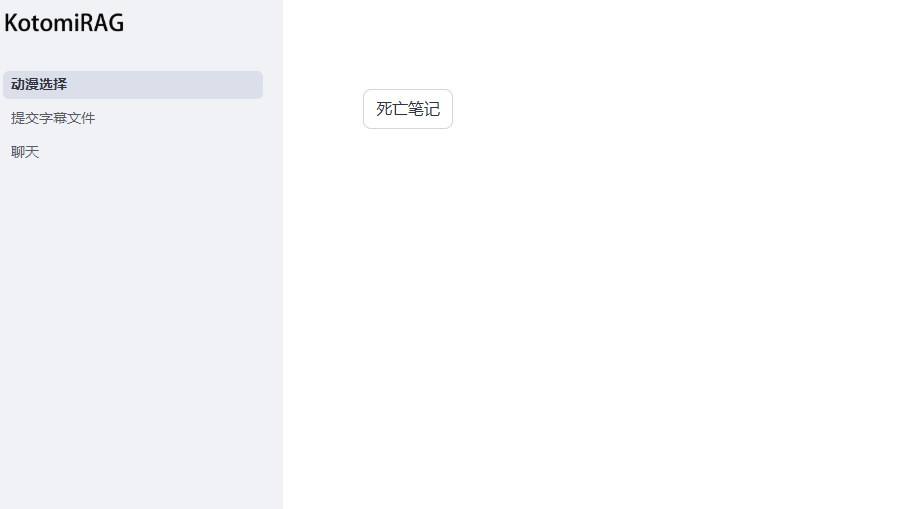
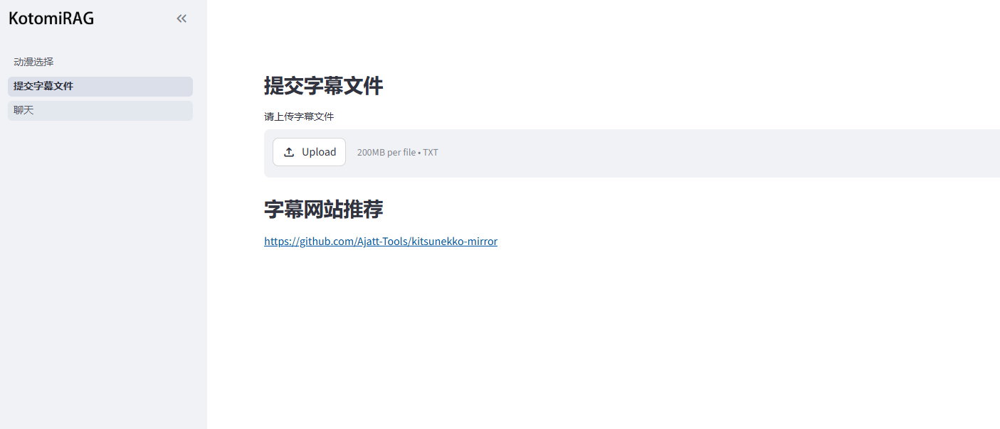
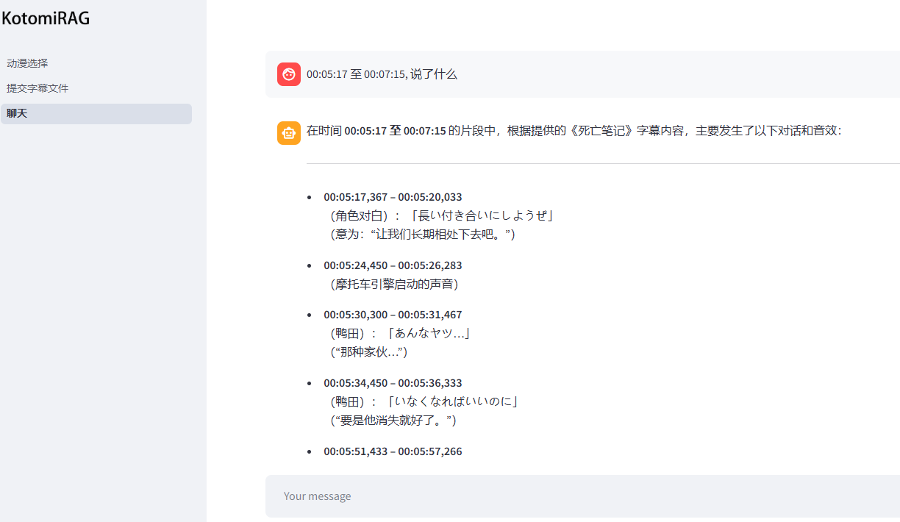

# KotomiRAG— Personal AI Anime Assistant

    <picture>
        
    </picture>

## Introduce

RAG练手项目, 项目主题是通过提交动漫字幕, 通过RAG更好地分析人物以及动漫剧情

## Project analysis

第一个部分目前只测试了一个, 当出现多个选项的时候能不能兼容还没有测试, 需要先提交字幕文件才能选择

提交的文件目前只支持单文件txt传输

聊天的功能需要配合“动漫选择”模块, 需要先点击动漫选择的某个选项才能正常使用

Tip: 除了以上问题, 项目中还有很多细节需要修改才能正常运行

